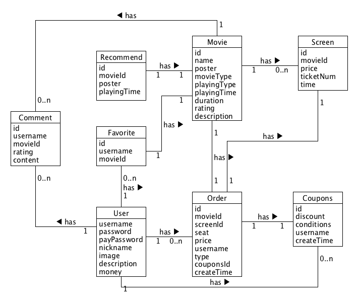

# MonkeyEye-FE
> 猿眼电影订票系统前端开发仓库
```bash
# 项目启动
npm run dev
# 项目构建
npm run build
```

## 1、协作规范
本仓库有2个分支，master和dev。主要在dev分支上进行开发和测试，功能完善之后再合并到master。
```txt
|----master
|----dev
```
#### 1.1、准备工作
在github上fork本仓库到你自己的github，将你fork之后的远程仓库克隆到本地，并在你的本地仓库上添加上游仓库，即源仓库。
```bash
git clone https://github.com/{你的github}/MonkeyEye-FE
# 上游的源仓库地址只需添加一次
git remote add upstream https://github.com/SYSUMonkeyEye/MonkeyEye-FE.git
```

#### 1.2.1、协作方式-1
要开发某个模块的时候，在你的本地仓库创建一个分支，例如mydev。
```bash
git checkout -b mydev
```
切换之后你的本地仓库上就有3个分支了，如下所示。checkout之后会自动切换到mydev分支。
```txt
|----master
|----dev
|----mydev
```
在mydev分支上进行开发和测试，完成相应的功能或者模块，完成之后再切回到dev分支将mydev的内容合并到dev。
```bash
# mydev分支上提交你的更新
git add *
git commit -m "add something"
# 切换到dev分支
git checkout dev
```
由于在你开发过程中，我也可能在开发并且更新了仓库，为了避免冲突，在合并分支之前你还需要更新你本地仓库的dev分支。先在本地仓库上添加上游仓库upstream，上游仓库即我的仓库，然后使用pull命令从上游仓库拉取更新。
```bash
# 拉取上游的源仓库dev分支上的更新
git pull upstream dev
```
更新完dev之后，将mydev分支合并到dev分支并提交到你自己的远程仓库。完成之后，mydev分支就可以删除了，你也可以继续留着。
```bash
# 将mydev分支合并到dev，可能会有冲突需要自行解决
git merge mydev
# 推送到你自己的远程仓库，注意这里是push到origin dev，不是upstream dev
git push origin dev
# 删除mydev分支
git branch -d mydev
```
推送到自己的远程仓库后，就可以到github上面给我发Pull Request了，然后等待我合并你的代码。

#### 1.2.2、协作方式-2
嫌上面太麻烦？你也可以直接在fork之后的的dev分支上面进行开发，然后在发送PR之前先从源仓库拉取更新。
```bash
# 提交你的代码
git add *
git commit -m "add something"
# 拉取上游的源仓库dev分支上的更新，可能会有冲突需要自行解决
git pull upstream dev
# 推送到你自己的远程仓库，注意这里是push到origin dev，不是upstream dev
git push origin dev
```

#### 1.3、备注
所有拉取远程仓库的更新的操作请在本地仓库上使用命令行完成。
```bash
# 拉取上游的源仓库dev分支上的更新
git pull upstream dev
```
严禁通过其他做法拉取更新（例如在GitHub网站上通过网页操作进行更新然后在本地pull origin dev），以免造成不必要的合并冲突以及多余的commit。

## 2、项目结构
```txt
├─build：存放构建用到的相关文件
├─config：存放配置文件
├─data：存放伪数据以及数据生成器供前端开发使用；也可以存放图片等静态资源
└─src：前端开发的源码
    ├─assets：图片等静态资源
    ├─common：公共样式或js文件
    │    └─css：样式文件
    │       ├─font.css：字体文件
    │       └─icon.css：图标文件
    ├─components：前端组件
    │    ├─auth：登录注册相关界面
    │    │   ├─Signin.vue：登录界面
    │    │   └─Signup.vue：注册界面
    │    ├─comment：电影评论评分相关界面
    │    │   └─MovieComment.vue：对电影进行评论评分界面
    │    ├─main：应用的主体界面
    │    │   ├─Main.vue：主体界面外层容器
    │    │   ├─Me.vue：个人中心界面
    │    │   └─Movies.vue：电影资讯界面
    │    ├─movie：电影相关界面
    │    │   ├─MovieDetail.vue：电影详情界面
    │    │   └─MovieSearch.vue：电影搜索界面
    │    ├─order：订单相关界面
    │    │   ├─MyOrders.vue：全部订单/待付款/待取票/待放映/已放映界面
    │    │   ├─OrderDetail.vue：订单详情界面
    │    │   ├─OrderPay.vue：付款界面
    │    │   └─Reservation.vue：下单选座界面
    │    └─profile：用户中心相关界面
    │        ├─Coupons.vue：优惠券界面
    │        ├─MovieCollection.vue：收藏/已看/想看电影界面
    │        └─UserInfo.vue：用户个人信息界面
    ├─router：前端路由
    ├─store：应用的全局状态管理
    ├─App.vue：应用的最外层结构
    └─entry.js：应用的入口文件；第三方组件和公共文件在此引入
```
项目模块结构和界面跳转关系


## 3、开发规范
1. Vue组件文件名使用首字母大写驼峰形式命名，例如"HelloWorld.vue"；name属性采取小写形式，例如"hello-world"，以符合HTML标签的规范，例如<hello-world></hello-world>
2. 文件夹采用小写短线形式命名，例如"images-for-readme"
3. 代码缩进为2个空格；语句末尾全部不写分号；其他代码风格细节参考eslint的提示进行修改
4. 使用pug+sass+es6进行开发
5. 各个界面在路由中已经引入并写好跳转关系，如果界面中需要用到自定义组件请将组件放置在该界面所在的文件夹里面
6. 伪数据程程器和伪数据json文件都放置在data文件夹下面。生成器和json文件的命名格式为"xxx-genertor.js"和"xxx.json"，其实"xxx"为上述各个数据模型的英文名称
7. 样式大小单位使用rem，不使用px。html元素的font-size固定为100px，rem与px之间的换算公式：1rem = 100px

## 4、数据模型
电影数据模型
```json
{
    "movie": {
        "id": "uid, 数据库ID",
        "name": "string, 电影名称",
        "poster": "string, 海报链接",
        "movieType": "string, 电影类型, 动作/冒险/爱情/喜剧等",
        "playingType": "string, 播放类型, 2D/3D/国语/外语等",
        "playingTime": "date, 上映日期",
        "duration": "integer, 电影时长",
        "rating": "integer, 电影评分, 取值范围0-5",
        "description": "string, 电影简介"
    },
    "example": {
        "id": "dheusidewhxj289f74gsuc78",
        "name": "速度与激情8",
        "poster": "/static/images/poster/dheusidewhxj289f74gsuc78.png",
        "movieType": "冒险 动作",
        "playingType": "3D|MAX",
        "playingTime": "1493001432820",
        "duration": "136",
        "rating": "5",
        "description": "这是一段很长很长的简介..."
    }
}
```
推荐电影数据模型
```json
{
    "recommend": {
        "id": "uid, 数据库ID",
        "movieId": "uid, 数据库ID",
        "poster": "string, 海报链接",
        "playingTime": "date, 上映日期"
    },
    "example": {
        "id": "dheusidewhxj289f74gsuc58",
        "movieId": "dheusidewhxj289f74gsuc78",
        "poster": "/static/images/poster/adadhehudhadhwkudhcbfei.png",
        "playingTime": "1493001432820"
    }
}
```
用户数据模型
```json
{
    "user": {
        "username": "string, 用户名/账号",
        "password": "string, 登录密码",
        "payPassword": "string, 支付密码",
        "nickname": "string, 昵称",
        "image": "string, 头像链接",
        "description": "string, 个签",
        "money": "double, 用户账户余额"
    },
    "example": {
        "username": "18819212345",
        "password": "xxxxxxxx",
        "payPassword": "xxxxxxx",
        "nickname": "风不定，人初静",
        "image": "/static/images/user/18819253798.png",
        "description": "风不定，人初静，明日落红应满径。",
        "money": "1234.56"
    }
}
```
场次数据模型
```json
{
    "screen": {
        "id": "uid, 数据库ID",
        "movieId": "uid, 数据库ID",
        "price": "double, 本场次电影票价格",
        "ticketNum": "integer, 本场次售票数量",
        "time": "date, 开始放映的时间"
    },
    "example": {
        "id": "dheusidewhxj289f74gswsu8",
        "movieId": "dheusidewhxj289f74gsuc78",
        "price": "48",
        "ticketNum": "120",
        "time": "1493001432820"
    }
}
```
订单数据模型
```json
{
    "order": {
        "id": "uid, 数据库ID",
        "movieId": "uid, 电影的数据库ID",
        "screenId": "uid, 场次的数据库ID",
        "seat": "string, 座位",
        "price": "double, 订单总额",
        "username": "string, 用户名",
        "type": "integer, 订单类型, 0:未支付, 1:待取票, 2:未上映, 3:待评价",
        "couponsId": "uid, 优惠券的数据库ID",
        "createTime": "date, 订单创建时间"
    },
    "example": {
        "id": "dheusidewhxj89if74gsuc78",
        "movieId": "dheusidewhxsud9f74gsuc78",
        "screenId": "dheusi8uwhxj289f74gsuc78",
        "seat": "36,37",
        "price": "80",
        "username": "18819212345",
        "type": "0",
        "couponsId": "dheusidewhxsud9f74gsuc78",
        "createTime": "1493001432820"
    }
}
```
优惠券数据模型
```json
{
    "coupons": {
        "id": "uid, 数据库ID",
        "discount": "double, 折扣, 5%、10%等",
        "conditions": "double, 使用条件, 例如满60元可用",
        "username": "string, 用户名",
        "createTime": "date, 创建时间"
    },
    "example": {
        "id": "d8uqsidewhxj289io4gsuc78",
        "discount": "0.1",
        "conditions": "36",
        "username": "18819212345",
        "createTime": "1493001432820"
    }
}
```
收藏(想看)电影数据模型
```json
{
    "favorite": {
        "id": "uid, 数据库ID",
        "username": "string, 用户名",
        "movieId": "uid, 电影的数据库ID"
    },
    "example": {
        "id": "d8uqsidewhxj289io4gsuc78",
        "username": "18819212345",
        "movieId": "d8isuoq1whxj289io4gsuc78"
    }
}
```
评论数据模型
```json
{
    "comment": {
        "id": "uid, 数据库ID",
        "username": "string, 用户名",
        "movieId": "uid, 电影的数据库ID",
        "rating": "integer, 评分, 取值范围0-5",
        "content": "string, 评价内容"
    },
    "example": {
        "id": "asow9sidewhxj289io4gsuc78",
        "username": "18819212345",
        "movieId": "d8uqsidewhxj289io4gsuc78",
        "rating": "5",
        "content": "很好看，很刺激！！！"
    }
}
```

